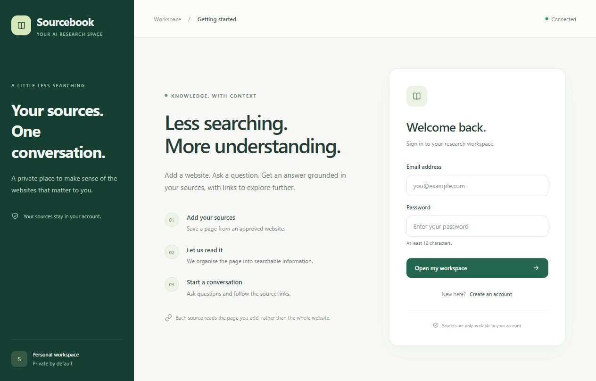

# Sourcebook AI

[](https://github.com/Anuskar123/sourcebook-ai/actions/workflows/ci.yml)

A research workspace that turns permitted website pages into searchable sources, structured knowledge graphs, and AI answers.



Three backend services plus one React frontend. This is runnable foundational code with production-oriented boundaries, not a production-certified deployment. The supplied classifier is a demo because no trained model or evaluation dataset was provided.

The frontend is branded Sourcebook: a light research workspace with a green source sidebar, onboarding, source status cards, approved-domain guidance, starter questions, a multiline composer, source links and a retry action for failed jobs. The interface supports desktop and mobile layouts. Model availability is separate from UI readiness.

## Folder tree

```text
sourcebook-ai/
|-- .github/workflows/ci.yml
|-- .dockerignore
|-- .env.example
|-- .gitignore
|-- README.md
|-- LOCAL_RUNTIME.md
|-- docker-compose.yml
|-- package.json
|-- package-lock.json
|-- requirements-native.txt
|-- scripts/
|   |-- init-env.mjs
|   |-- doctor.mjs
|   |-- wsl-status.mjs
|   |-- doctor-native.py
|   |-- smoke.mjs
|   |-- prepare-native.py
|   |-- start-native.py
|   `-- stack.mjs
|-- apps/
|   `-- web/
|       |-- Dockerfile
|       |-- index.html
|       |-- nginx.conf
|       |-- package.json
|       |-- vite.config.js
|       `-- src/
|           |-- App.jsx
|           |-- main.jsx
|           `-- styles.css
|-- services/
|   |-- api/
|   |   |-- Dockerfile
|   |   |-- package.json
|   |   |-- server.js
|   |   |-- app.js
|   |   |-- config.js
|   |   |-- models.js
|   |   |-- rag.js
|   |   |-- test/app.test.js
|   |   `-- test/wsl.test.js
|   |-- worker/
|   |   |-- Dockerfile
|   |   |-- requirements.txt
|   |   |-- agent.py
|   |   |-- schemas.py
|   |   `-- scraper.py
|   `-- ml/
|       |-- Dockerfile
|       |-- requirements.txt
|       |-- main.py
|       `-- train_demo.py
`-- tests/
    |-- requirements.txt
    |-- test_ml.py
    |-- test_worker.py
    `-- test_native_doctor.py
```

Generated directories excluded from the tree and ZIP: node_modules, dist, Python caches. The ML image generates models/classifier.joblib during its build.

## Run with Docker Compose

Requires Docker Engine with Compose v2. From the repository root:

```powershell
npm run setup
# Generates five random secrets without printing them; preserves an existing .env.
# Set GEMINI_API_KEY and SCRAPE_ALLOWED_HOSTS in .env.
npm run doctor
npm start
npm run logs
```

Open http://localhost:5173, create an account, submit a permitted website URL, wait for `completed`, then ask a question about the source. The classifier's label and demo flag are available in the job status response. Tokens expire after 15 minutes; sign in again when prompted. There is no refresh-token or password-reset flow in this starter.

The required MongoDB, Neo4j and FastAPI services run with `docker compose up --build -d`. Chroma also runs by default because RAG needs it. The `app` profile adds API, worker and frontend. API/worker Gemini calls require a real key; the infrastructure and demo ML service do not.

`npm run status` shows container state. `npm stop` stops the stack while preserving database volumes. `npm start` validates prerequisites before building and waits for service startup. On Windows, install Docker Desktop and complete its WSL 2 setup first; the setup script does not change Windows features or restart the computer.

After the stack starts, `npm run smoke` checks authentication, Node-to-FastAPI inference, the worker pipeline and Gemini RAG through the real HTTP APIs. It creates a disposable account and source snapshot in your local databases and consumes Gemini API usage. The default source is `https://example.com`; if your allowlist differs, set `SMOKE_SOURCE_URL` in `.env` to a permitted page. This is an opt-in integration check, separate from CI. See LOCAL_RUNTIME.md for runtime instructions.

| Service | Host address | Container address |
| --- | --- | --- |
| React via Nginx | http://localhost:5173 | web:8080 |
| Express | http://localhost:3000 | api:3000 |
| FastAPI | http://localhost:8001/docs | ml:8001 |
| MongoDB | localhost:27018 | mongo:27017 |
| Chroma | http://localhost:8000 | chroma:8000 |
| Neo4j Browser | http://localhost:7474 | neo4j:7474 |
| Neo4j Bolt | bolt://localhost:7687 | bolt://neo4j:7687 |

Ports bind to loopback. Browser requests go to the frontend origin's `/api` proxy. Docker services use service DNS names, never host localhost for cross-container calls. MongoDB, Neo4j and Chroma use persistent named volumes. Do not run `down -v` unless you intend to erase their data.

MongoDB uses host port 27018 to reduce conflicts with host installations. Set MONGO_HOST_PORT to change the host binding and update MONGODB_URI for host-side tools accordingly. Container traffic continues to use mongo:27017.

## Local application development

Start infrastructure with Compose. In `.env`, update the host `MONGODB_URI` password to match `MONGO_PASSWORD`; use hex secrets to avoid URL encoding problems. Compose supplies the container URI automatically.

```powershell
npm ci
npm run dev:api
# Separate terminal:
npm run dev:web
# Separate terminal, from monorepo root:
py -3.12 -m venv .venv
.venv\Scripts\python -m pip install -r services/worker/requirements.txt
.venv\Scripts\python services/worker/agent.py
```

Use Node 22.12+ and Python 3.12. npm package-lock.json pins the JavaScript dependency graph. Python direct dependencies are pinned to the tested versions; generate and review target-platform transitive lockfiles and hashes before a release. Image tags are versioned but not digest pinned.

## Data flow and entry points

1. React sends registration/login requests to Express and holds a short-lived JWT in memory.
2. `POST /api/jobs` validates an exact HTTPS hostname allowlist, takes ownership from the JWT, persists a queued MongoDB job, and returns HTTP 202. The worker is an asynchronous consumer, not an unauthenticated HTTP task executor.
3. `agent.py` atomically claims jobs with a renewable lease. Its LangGraph is `scrape -> extract -> classify -> persist -> index`. Completed node outputs are checkpointed in MongoDB and reused on retries. This uses application-level checkpoints, not LangGraph's native checkpointer API.
4. The scraper resolves public addresses, pins the chosen address for TLS, refuses redirects, and limits body size and duration. Only add trusted, permitted domains. This starter performs a single-page fetch, not recursive crawling or robots.txt scheduling; an operator must review crawl permission and policy before allowlisting a host.
5. The worker calls Gemini's REST API with a supported structured-output schema, then validates the returned JSON with Pydantic. Pydantic enforces strict extra-field, length and relationship-reference rules locally. The worker posts the extracted summary to FastAPI `/predict` with `X-Service-Token` before writing classification and relationships to Neo4j. All Cypher values are parameters, and graph IDs are scoped to a job snapshot.
6. The worker posts the original page text to Express `/internal/jobs/:id/index`. A service token and active lease are required. Express derives the owner from the stored job, chunks text, calls Gemini embeddings, and upserts Chroma vectors. No model key reaches the frontend.
7. `POST /api/chat` retrieves from a per-user Chroma collection, then calls Gemini through LangChain `ChatGoogle`. Source text is treated as untrusted input. Returned source links identify retrieved documents, not independently verified claim-level citations. Each request is standalone; the UI's visible transcript is not passed as model memory.

The Node entry point is `services/api/server.js`; its routes are deliberately separated into `app.js` for testing. `rag.js` owns retrieval and generation. `services/worker/agent.py` contains the complete graph, queue consumer, HTTP calls and graph writes. `services/ml/main.py` loads its artifact once at startup and implements inference routing.

Neo4j stores `Page -[:MENTIONS]-> Entity` and `Entity -[:RELATED_TO {kind}]-> Entity`. Relationship semantics are stored in the `kind` property. Neo4j powers the extracted knowledge graph; this starter's chat retrieval uses Chroma, not graph traversal. Reindexing a URL creates another immutable source snapshot rather than replacing older snapshots.

## API contracts

| Method and route | Authentication | Request / response |
| --- | --- | --- |
| POST /api/auth/register | Public, rate limited | `{email,password}` -> `{token}` |
| POST /api/auth/login | Public, rate limited | `{email,password}` -> `{token}` |
| POST /api/jobs | Bearer JWT | `{url}` -> `{id,status}` |
| GET /api/sources/policy | Bearer JWT | HTTPS requirement and exact approved hostnames |
| GET /api/sources | Bearer JWT, owner scoped | indexed chunk count and 20 most recent jobs |
| GET /api/jobs/:id | Bearer JWT, owner scoped | status, result, safe error |
| POST /api/chat | Bearer JWT | `{message}` -> `{answer,sources}` |
| POST /api/classify | Bearer JWT | `{text}` -> prediction; Node calls FastAPI |
| POST /internal/jobs/:id/index | Internal token and active lease | `{text,leaseToken}` -> `{chunks}` |
| POST /predict on ML | ML service token | `{text}` -> `{label,confidence,model_version,demo}` |
| GET /health/live | Public | process liveness |
| GET /health/ready | Public | API checks Mongo/Chroma; ML checks loaded model |

No secrets are included. Obtain a Gemini key independently and choose model IDs available to your account. Models are configurable. Changing embedding models requires reindexing into new collections; do not mix vector dimensions or incompatible embedding spaces.

The frontend restores recent job status after sign-in and checks source readiness every five seconds. Chat is enabled only when the signed-in account has indexed chunks. Sources remain private to their owner, including accounts used for smoke tests.

## Classifier contract

`train_demo.py` trains a tiny TF-IDF/logistic-regression text classifier for technology, business and education. It exists to exercise REST inference and is not a quality benchmark. Its maximum class probability is returned as `confidence`, not a calibrated correctness guarantee. Every response and Neo4j page explicitly records `demo: true`.

To deploy your own classifier, replace the Docker training step with a trusted release artifact containing `{model, version, demo}`; the model must expose `predict_proba` and `classes_`. Set `demo` false only for your evaluated replacement. For PyTorch, keep the REST response schema and replace the artifact loader and prediction function with your tokenizer and trained module. Never load user-supplied pickle/joblib files.

## Verification

```powershell
npm test
npm run build
py -3.12 -m venv .venv
.venv\Scripts\python -m pip install -r tests/requirements.txt
.venv\Scripts\python -m pytest tests -q
```

The local verification suite contains 10 Node tests and 15 Python tests. CI runs these checks without real API keys or private data. Live integration checks require your own configured credentials and permitted source.

GitHub Actions runs the Node tests and frontend build, Python tests and dependency compatibility check, and Compose configuration validation on pushes and pull requests. These checks do not call Gemini or start the database stack. Check the badge above for the latest GitHub run. Passing CI verifies these scoped checks, not a production deployment or model quality.

## Before production deployment

This boilerplate includes bcrypt, JWT validation, per-user retrieval, input limits, basic rate limiting, service credentials, SSRF-aware fetching, retries, lease fencing and stable sink IDs. Production release still needs:

- An evaluated classifier and end-to-end RAG/extraction quality tests on representative sources.
- TLS ingress, a secret manager, distinct least-privilege database users, internal network policy and restricted Chroma access. Compose root Mongo credentials are a local-development convenience.
- Managed identity or token rotation, auth lifecycle flows, and a shared rate-limit store for multiple API replicas. The current in-memory limiter is per process. Set Express proxy trust only for verified ingress hops.
- Job admission quotas, crawling policy/robots support where required, retention/deletion across all stores, monitoring, backups and restore tests.
- A reconciliation process for partial sink failures. MongoDB, Neo4j and Chroma do not share a transaction. A crash can leave a graph snapshot visible before indexing completes. Delivery is at least once; stable IDs and checkpoint reuse make sink retries idempotent, not globally atomic or exactly once.
- Target-platform dependency locks, image digests, vulnerability review, load tests and deployment smoke tests. The scraper also needs network-level egress restrictions as a second layer.

## API references checked

- [LangChain ChatGoogle](https://docs.langchain.com/oss/javascript/integrations/chat/google): recommended Google integration package.
- [LangGraph Graph API](https://docs.langchain.com/oss/python/langgraph/graph-api): StateGraph and node/edge execution.
- [Gemini structured output](https://ai.google.dev/gemini-api/docs/structured-output): schema-driven extraction.
- [Chroma TypeScript API](https://docs.trychroma.com/reference/typescript/): client, collections and vector operations.
